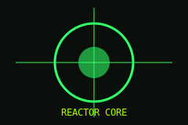

# Reactor Diagnostics

Run the following on the maintenance terminal:

```bash
sudo vaultctl reactor --status --verbose
```

Expected output:

```
core temp .... 451 K
coolant ...... OK
containment .. 99.7%
```

Containment schematic:



All systems within acceptable parameters. Resume normal operations.
