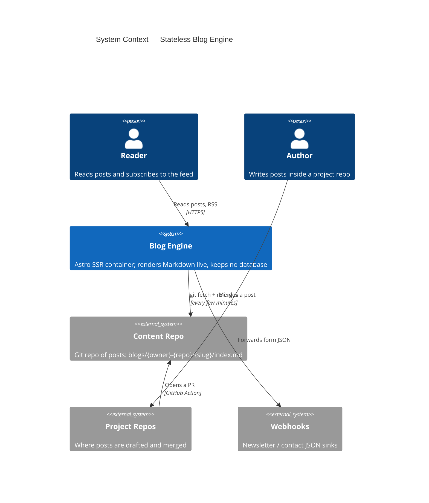
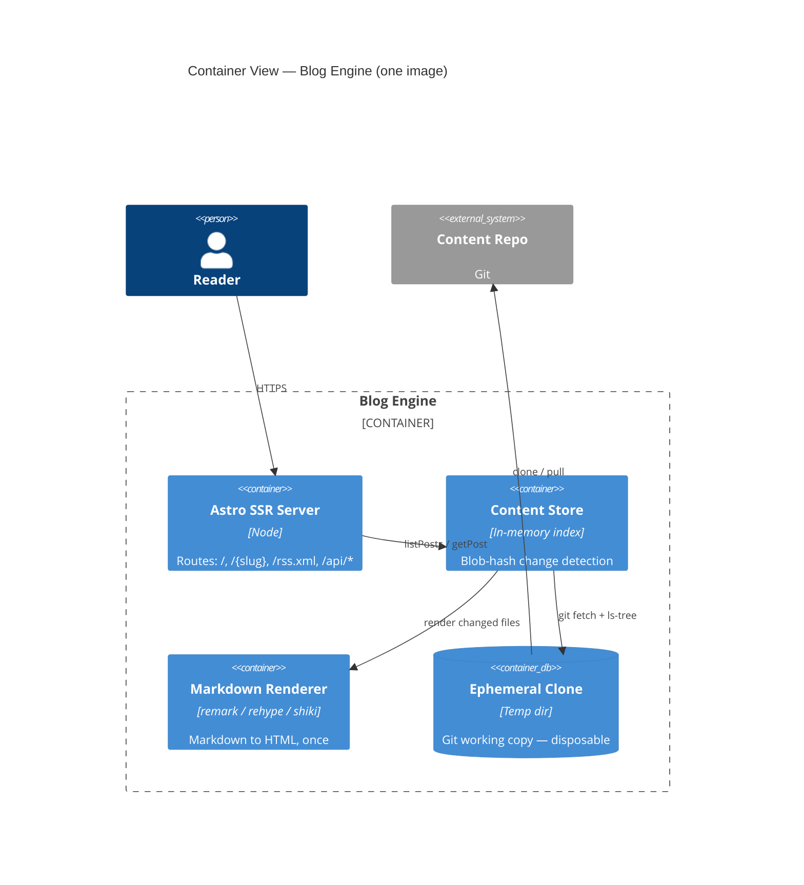

*A stateless, container-based blog engine that keeps no database, publishes posts through a git pull request, and renders Markdown live.*

The blog you are reading runs on an engine dressed up as a [Fallout](https://fallout.bethesda.net/) computer terminal — the green-on-black RobCo Pip-Boy look, a boot-up typewriter title, an occasional CRT screen-roll, and a Vault Boy waving in the corner. The theme is a joke about old, forgetful machines. It turns out the joke also describes the architecture: the engine remembers almost nothing. Restart it and it forgets every post — then rebuilds its entire world from a git repository in a few seconds. This post is about why a blog would be built that way, and how the pieces fit.

## Problem Statement

Most blogs take one of two shapes, and both have a cost.

A **static site generator** turns Markdown into HTML at build time. It is fast and cheap to host, but every new post means running a build and redeploying the site. Publishing *is* a deploy. Even a typo fix becomes a full pipeline run.

A **database-backed CMS** (WordPress and friends) lets you publish without a deploy, but now you own state: a database to back up, migrate, patch, and secure. Content and software are tangled together. Moving hosts, or running a second copy, means carrying that state with you.

The goal here was a third shape: publish a post as easily as merging a pull request, and keep the running engine completely **stateless** — no database, nothing on disk worth backing up, containers you can kill and replace at will. The content should live on its own, as plain Markdown, in a git repo that outlives any particular version of the software.

## Solution

The engine is an [Astro](https://astro.build) server rendered on demand (SSR) and packaged as a single container image. Its defining choice is where the content lives: **not** inside the image, but in a **separate git repository**.

Posts are just folders in that content repo:

```
blogs/{owner}-{repo}/my-post/index.md
blogs/{owner}-{repo}/my-post/assets/diagram.png
```

On startup the engine clones the content repo into a throwaway directory, reads the tracked files, and renders each Markdown file to HTML once — holding the result in an in-memory index. A post's URL is its slug (`/my-post`). Its **published date is read from git**: the timestamp of the first commit that added the file. There is no `date:` field to keep in sync, though you can override it if you need to.

Then it waits. Every few minutes it runs `git fetch` against the content repo and compares each file's git blob hash to what it rendered last time. Only files whose hash changed are re-rendered; everything else is left untouched. A new post goes live on the next request after a sync — no rebuild, no restart, no deploy.

### The architecture at a glance

At the highest level, the engine sits between people and a handful of external systems — the content repo it reads from, and the webhooks it forwards form submissions to.



Zooming into the container, the moving parts are small and each has one job.



The key detail is the **ephemeral clone** — a git working copy in a temporary directory. If it disappears (a crashed container, a fresh instance, a new node in a cluster) the engine simply clones it again on the next start. Nothing important lives there. Run ten copies of the engine and each keeps its own private clone and its own in-memory index; they never talk to each other, because there is nothing to share.

### Publishing is a pull request

Because content is a git repo, publishing is a git operation — and you do not have to edit the content repo by hand. A reusable GitHub Action watches a **project** repo where you draft a post under `blogs/{slug}/`. When that post is merged to `main`, the Action opens a pull request in the content repo that copies the whole post folder — Markdown and assets — into `blogs/{owner}-{repo}/{slug}/`. The `{owner}-{repo}` prefix keeps posts from different projects from colliding.

So the flow is: write a post inside whatever project it is about, merge it there, review the auto-opened PR in the content repo, merge again — and the running engine picks it up on its next sync. The engine itself is never touched.

### RSS and the newsletter

Two features let the blog reach readers without them coming back to check.

An **RSS feed** is served at `/rss.xml`. It is built straight from the same in-memory index the pages use — newest first, each post's teaser as the item description — and cached for five minutes. Any feed reader can subscribe.

A **newsletter** offers a weekly digest of recent posts. It is described in config (how many days it summarizes, the schedule, the timezone shown in the sign-up box) and — true to the stateless rule — **the engine stores no email addresses**. A subscribe or unsubscribe action is validated, passes a slide-puzzle captcha, and is POSTed as plain JSON to a webhook you choose. Wire that webhook to a mailing service, a spreadsheet, or your own endpoint; the blog itself sends nothing and remembers no one.

### The CI/CD behind it

Three GitHub Actions workflows do the heavy lifting, and each is worth calling out.

- **Publish** (`publish-blogpost.yml`) — the author-to-blog pipeline above. It detects exactly which posts a push changed, fans out one job per post, and opens (or updates) one pull request per post in the content repo. A `dry_run` switch prints what it *would* publish without opening anything, and the whole file is self-contained, so it doubles as a copy-paste template for any project repo.
- **PR validation** (`version.yml`) — on every pull request it computes and commits a preview version bump, then runs a fast amd64-only container build and a Helm chart lint/render as a required status check. It pushes the bump with a token that re-triggers the check on the right commit, so the green tick lands exactly where branch protection expects it.
- **Release** (`release.yml`) — on merge it bumps and tags the version, then builds the image on **native runners for both amd64 and arm64** (no slow emulation), pushes each by digest, and stitches them into one multi-arch image under moving tags (`latest`, major, minor, exact). It also packages and pushes a Helm chart and cuts a GitHub Release. Multi-arch means the same image runs on an Intel server or an ARM box, unchanged.

## Considerations Behind the Solution

Statelessness is a trade, not a free win.

**Rendering in memory** means each instance re-renders on boot and holds every post's HTML in RAM. For a personal blog that is nothing; for tens of thousands of posts it would need rethinking. Change-detection by blob hash keeps steady-state syncs cheap — usually nothing changed, so nothing re-renders.

**Git-derived dates** remove a whole class of "the date in the file disagrees with reality" bugs, but they make the content repo's history meaningful. A `date:` override exists for imports and back-dating.

**No database** removes backups, migrations, and a security surface — the content repo *is* the backup, and it is already versioned. The price is that anything normally stored (newsletter sign-ups, contact messages) is pushed out to a webhook instead of kept. That keeps the engine disposable, which was the point.

**Separating content from engine** means you can upgrade the software by pulling a new image with zero risk to your posts, and run the exact same image locally, in staging, and in production, each pointed at different content.

## Conclusions

A blog does not need a database to publish without deploying. By moving content into its own git repo and having a stateless engine pull and render it live, you get the publishing ergonomics of a CMS (merge a PR, it appears) with the operational simplicity of a static site (kill the container, start another). Dates come from git, promotion happens through pull requests, and reach is handled by an RSS feed and a storage-free newsletter. The Fallout terminal is just the paint — but a machine that cheerfully forgets everything and rebuilds from git turned out to be a fitting mascot.

## Why Should You Adopt It?

- **Nothing to back up.** Your posts are a git repo; that is already your backup and your history.
- **Publishing without deploying.** New posts appear on the next sync — no build, no restart.
- **Truly disposable instances.** Stateless containers scale, restart, and move with no data migration.
- **Portable by construction.** One multi-arch image (amd64 + arm64), configured by one `config.yaml` and a few environment variables for secrets.
- **Reach built in.** RSS and a webhook-based newsletter, with no reader data stored on the server.

## How Should You Adopt It?

1. **Create a content repo** and add a post as `blogs/{owner}-{repo}/my-post/index.md`.
2. **Run the engine container**, pointed at that repo via `config.yaml` (`content.repo`), and open the site — the post is live.
3. **Automate publishing** by copying `publish-blogpost.yml` into any project repo and editing its `env:` block; draft posts there and let the Action open the content-repo PR for you. Try it with `dry_run: true` first.
4. **Turn on reach** — link readers to `/rss.xml`, and point the newsletter webhooks at your mailing tool of choice.

Source: https://github.com/justcallmegreg/blog
