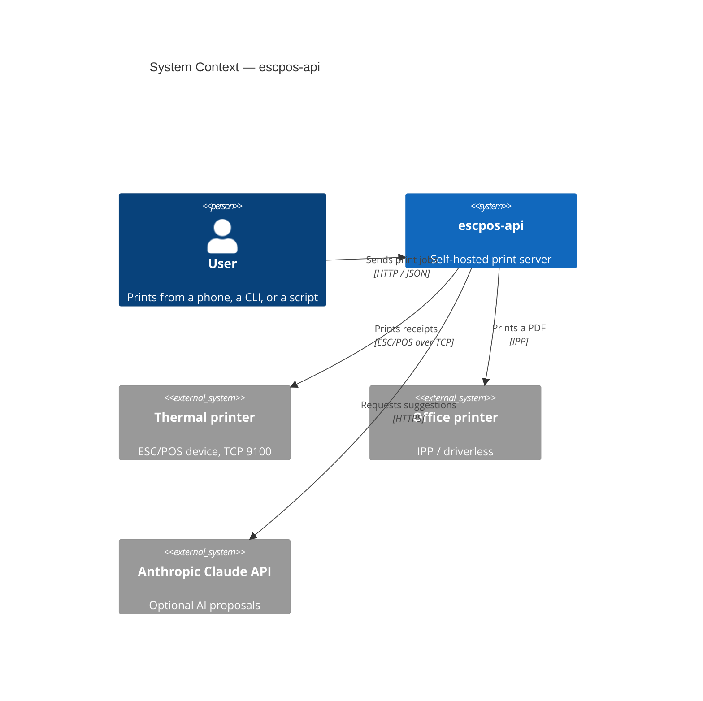
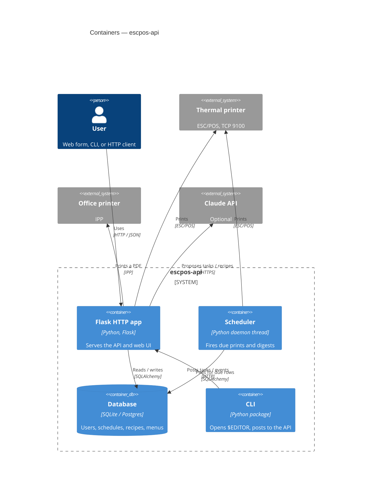
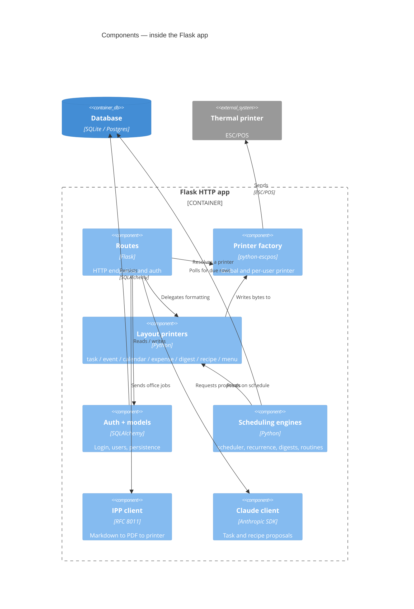

*escpos-api began as a handful of print endpoints and grew into a small self-hosted print server. This post uses the C4 model to zoom from the big picture down to the code, so you can grasp the whole thing in one read.*

## Problem Statement

Side projects rarely stay small. `escpos-api` started as a few HTTP endpoints that pushed text to a thermal receipt printer. Over time it picked up formatted receipts, a month calendar, expense slips, recipes and weekly menus, multi-user accounts, a background scheduler, periodic digests, optional Claude-assisted suggestions, a second print path for office printers, a phone-friendly web form, and a command-line client.

Each addition made sense on its own. Together they make the project hard to explain in one breath. "It's a Flask app that prints things" is true but useless. A full file-by-file tour is accurate but exhausting. New readers — and the author six months later — need a way to see the whole system at a glance and then drill into just the part they care about.

That is the problem this post solves: not a bug, but *comprehension*. The tool for the job is the **C4 model**.

## Solution

C4 is a way to describe software architecture at four levels of zoom: **Context, Container, Component, and Code**. Each level is a map at a different scale. You start wide and zoom in only as far as you need. `escpos-api` maps onto these four levels cleanly, so they make a good spine for explaining it.

### Level 1 — Context: the system and its neighbours

At the widest zoom, `escpos-api` is a single box: a self-hosted print server. Around it sit the people and systems it talks to.

- **People** send print jobs three ways: a phone-friendly **web form** served at the root path, a companion **CLI** that opens your `$EDITOR` and posts the result, and any **HTTP client** — a `curl` in a deploy script posting a build result, for example.
- **The thermal printer** is an external system: a network-connected ESC/POS device the server reaches over TCP (port `9100` by default).
- **Office printers** are a second, separate target. A `/cups/print` endpoint renders Markdown to PDF and sends it to any IPP-capable printer ("IPP Everywhere" / driverless).
- **The Anthropic Claude API** is an optional outside dependency, used only when AI proposals for tasks or recipes are enabled at runtime. No API key lives in the repo.

The diagram and the list say the same thing at two levels of detail: who uses it, and what it depends on.

### Level 2 — Container: the runnable pieces

Zoom in and the one box becomes a few separately runnable parts. In C4 a "container" is a deployable or runnable unit, not necessarily a Docker container.

- **The Flask HTTP app** is the heart. `run.py` calls `create_app()`, which wires configuration, builds the printer, creates the database, registers routes, and starts the scheduler. It also serves the web UI (templates and static files) — no separate frontend.
- **A relational database** holds users, schedules, routines, recipes, and menus. It defaults to a local SQLite file and can be pointed at Postgres through `DATABASE_URL`.
- **A background scheduler** runs as a single daemon thread inside the app, polling every 60 seconds for due scheduled prints and digests.
- **The CLI** is its own installable package under `cli/`, talking to the app over HTTP.

The app ships as a Docker image built for both `linux/amd64` and `linux/arm64`, configured entirely through `ESCPOS_*` environment variables.

### Level 3 — Component: inside the Flask app

Zoom into the Flask container and you find the components — the modules that do the work.

- **`routes.py`** is the HTTP layer: status checks, the print endpoints, account and avatar management, and the CUPS path.
- **`printer.py`** is a factory. It builds the shared network printer from config, and — neatly — resolves a *per-user* printer when a logged-in user has their own host and port. Set `ESCPOS_DUMMY` and it returns an in-memory dummy so you can develop with no hardware.
- **The layout components** each own the formatting for one kind of output: `task_printer`, `event_printer`, `calendar_printer`, `expense_printer`, plus `digest_printer`, `recipe_print`, and `menu_print`. This is where a task becomes bold labels, a Unicode box, and a QR code per URL.
- **`auth.py`, `models.py`, and `db.py`** cover login/signup and persistence, with `runtime_config.py` storing settings that can change without a restart.
- **The scheduling components** — `scheduler.py`, `recurrence.py`, `digest_engine.py`, `routines_engine.py` — decide what fires and when.
- **The outward-facing clients** — `claude_client.py` (a thin wrapper over the Anthropic SDK), `ipp_client.py` (a hand-built IPP client following RFC 8011), and `markdown_renderer.py` / `raster.py` — each isolate one external protocol or format.

The pattern is consistent: one component per responsibility, and each external protocol quarantined behind its own module.

### Level 4 — Code: the smallest zoom

The deepest level is individual functions and classes. You rarely draw this by hand — it lives in the source and changes constantly — but a few anchors show the shape:

- `create_app()` is the composition root where everything is wired together.
- `make_thermal_printer()` returns a `Network` or `Dummy` printer from connection parameters.
- `print_task()` turns a summary and description into a formatted receipt.
- The `Scheduler` class owns the daemon thread and the polling loop.

C4 recommends stopping here unless a specific piece of code genuinely needs a diagram. For most readers, Levels 1 to 3 are enough.

## Considerations Behind the Solution

C4 was chosen over the alternatives for a reason. A single architecture diagram tries to show everything and ends up showing nothing. UML is precise but heavy, and few small projects keep it current. C4's insight is **progressive disclosure**: four maps at four scales, each honest about its own level of detail. A reader takes only the zoom they need and stops.

It also matches how `escpos-api` is actually built. The project already separates concerns the way the levels do — routes at the edge, layout components in the middle, protocol clients (Claude, IPP) at the boundary. Describing it with C4 did not require reshaping the code; the code was already close to the model. That is a useful signal in both directions: a clean structure is easy to draw, and drawing it exposes where the structure is not clean.

The main trade-off is that the two lower levels drift. Components and code change with every feature, so a hand-maintained Level 3 or 4 diagram goes stale fast. The practical answer is to keep the top two levels — Context and Container — deliberate and stable, and treat the lower two as lightweight: a rough sketch like the component diagram above, or one generated from the source, rather than an artifact you promise to keep current by hand.

## Conclusions

`escpos-api` is a self-hosted Flask print server: a web form, a CLI, and an HTTP API in front of a thermal printer, with accounts, scheduling, digests, an optional office-printer path, and optional Claude suggestions.

More usefully, you now have a repeatable way to read a project like it. Start at Context — who uses it and what it depends on. Drop to Container — the runnable parts and where state lives. Drop again to Component — the modules and their responsibilities. Only touch Code when a specific function earns the attention. The same four zoom levels work on any codebase, including your own, and they turn "it's a Flask app that prints things" into something a newcomer can actually hold in their head.

Source: https://github.com/justcallmegreg/escpos-api
